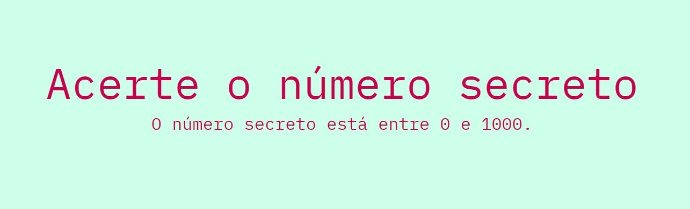

<h1 align='center'>Vamos jogar? 🎮</h1>
<h3 align='center'>Acerte o número secreto. </h3>

  

 Projeto desenvolvido no curso de Javascript: validações e reconhecimento de voz da plataforma Alura

## ⚙️Tecnologias
* HTML
* CSS
* Javascript 
* API Web Speech

## 💻Projeto

É um jogo que ao atualizar a página do navegador o computador define um número secreto, e cada pessoa fala seu chute dando seu palpite para acertar o número.
Em caso de acerto mostrará uma mensagem, mas se errar o sistema dá uma dica. 
Bom jogo. 

📍  [Acesse aqui](https://numero-secreto-nyr7f7i5n-keniacunha.vercel.app/)

